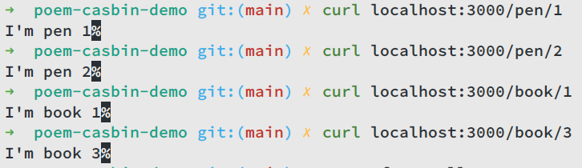
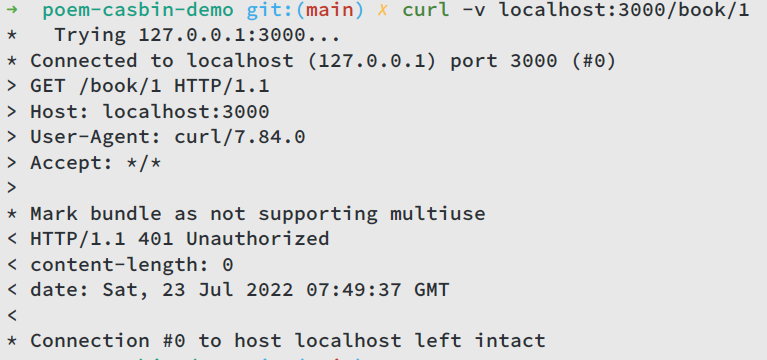
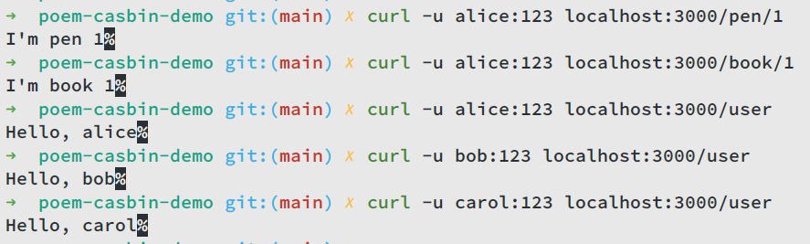
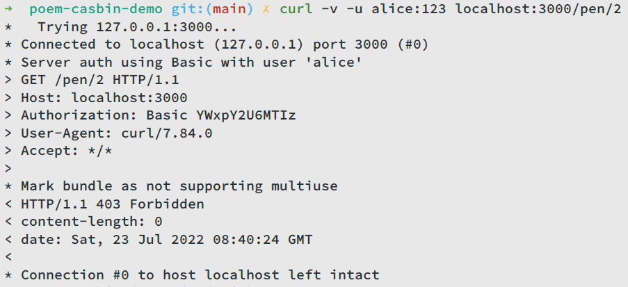
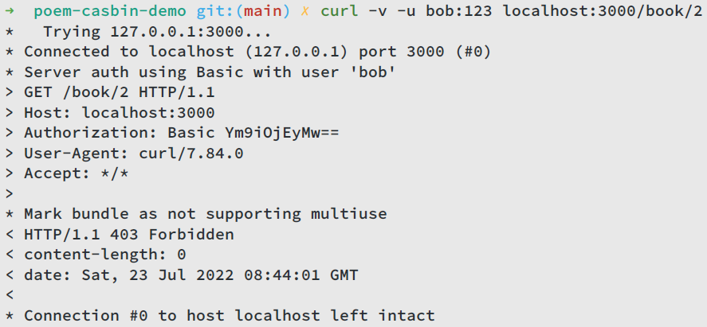
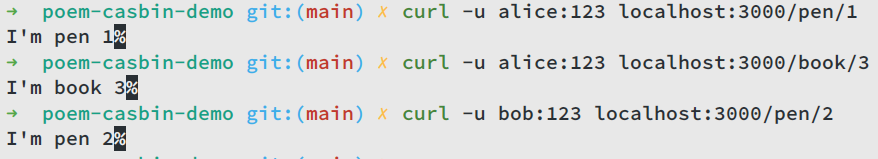

# poem-casbin-demo
Demo to integrate poem with casbin-rs using poem-casbin middleware

## Introduction

[Casbin-rs](https://github.com/casbin/casbin-rs) is an authorization library that supports access control models like ACL, RBAC, ABAC written in Rust.

[Poem](https://github.com/poem-web/poem) is a full-featured and easy-to-use web framework with the Rust programming language.

In this tutorial, we will integrate casbin-rs with poem web services using [poem-casbin](https://github.com/casbin-rs/poem-casbin) middleware.

## Write a hello-world service with poem

First, create a cargo crate, then add following dependencies in `Cargo.toml`:

```toml
tokio = { version = "1.20.0", features = ["rt-multi-thread", "macros"] }
poem = "1.3.35"
```

Add following code to `main.rs`

```rust
use poem::{get, handler, listener::TcpListener, web::Path, Route, Server};
use std::env;

#[handler]
fn pen1() -> String {
    String::from("I'm pen 1")
}

#[handler]
fn pen2() -> String {
    String::from("I'm pen 2")
}

#[handler]
fn book(Path(id): Path<String>) -> String {
    format!("I'm book {}", id)
}

#[tokio::main]
async fn main() -> Result<(), std::io::Error> {
    if env::var_os("RUST_LOG").is_none() {
        env::set_var("RUST_LOG", "poem=debug");
    }
    let app = Route::new()
        .at("/pen/1", get(pen1))
        .at("/pen/2", get(pen2))
        .at("/book/:id", get(book));
    Server::new(TcpListener::bind("127.0.0.1:3000"))
        .name("poem-casbin-demo")
        .run(app)
        .await
}
```

There are 3 endpoints, `/pen/1`, `/pen/2`, and `/book/:id`. It’s quite simple, right? Let’s run our service, enter `cargo run` and our service will be available at `127.0.0.1:3000`.

Let’s use `curl` to test our service:



## Integrate with basic auth middleware

Note that casbin-poem is an authorization middleware, not an authentication middleware. Casbin only takes charge of permission control, so we need to implement an authentication middleware to identify user.

In this part, we will integrate a basic auth middleware with our service.

To start with, add following dependency to `Cargo.toml`:

```toml
poem-casbin-auth = { git = "https://github.com/casbin-rs/poem-casbin.git" }
```

Then create a file named `auth.rs` and add following code to it:

```rust
use poem::{
    http::StatusCode,
    web::{
        headers,
        headers::{authorization::Basic, HeaderMapExt},
    },
    Endpoint, Error, Middleware, Request, Result,
};
use poem_casbin_auth::CasbinVals;

pub struct BasicAuth;

impl<E: Endpoint> Middleware<E> for BasicAuth {
    type Output = BasicAuthEndpoint<E>;

    fn transform(&self, ep: E) -> Self::Output {
        BasicAuthEndpoint { ep }
    }
}

pub struct BasicAuthEndpoint<E> {
    ep: E,
}

#[poem::async_trait]
impl<E: Endpoint> Endpoint for BasicAuthEndpoint<E> {
    type Output = E::Output;

    async fn call(&self, mut req: Request) -> Result<Self::Output> {
        if let Some(auth) = req.headers().typed_get::<headers::Authorization<Basic>>() {
            let vals = CasbinVals {
                subject: String::from(auth.username()),
                domain: None,
            };
            req.extensions_mut().insert(vals);
            self.ep.call(req).await
        } else {
            Err(Error::from_status(StatusCode::UNAUTHORIZED))
        }
    }
}
```

In this mod, we implement a basic auth middleware, for simplicity, here we don’t verify username and password, instead we just insert `CasbinVals` with provided username into `Extension`, so that poem-casbin middleware can extract identity information. If the request doesn’t have basic auth, then the middleware will return 401 Unauthorized.

Then let’s integrate this basic auth middleware with our service. Firstly, add following code to `main.rs`:

```rust
mod auth;

use poem_casbin_auth::CasbinVals;
```

Then add a new handler to confirm that our auth middleware insert identity information correctly:

```rust
#[handler]
fn user(data: Data<&CasbinVals>) -> String {
    format!("Hello, {}", &data.subject)
}
```

Lastly, rewrite `main` function to add an endpoint `/user` and wrap all endpoints with basic auth middleware, now it looks like:

```rust
let app = Route::new()
		.at("/pen/1", get(pen1))
		.at("/pen/2", get(pen2))
		.at("/book/:id", get(book))
		.at("/user", get(user))
		.with(casbin_middleware)
		.with(auth::BasicAuth);
```

Now, let’s use `curl` again to test our service.



Now as you can see, if we don’t provide basic auth when accessing our service, we will get 401 Unauthorized. Our request is aborted by basic auth middleware. Let’s send requests with basic auth:

```bash
curl -u alice:123 localhost:3000/book/1
```



Now we can get response as normal. It seems that our basic auth middleware works well.

## Integrate with poem-casbin middleware

In the last part, we will integrate poem-casbin middleware with our service.

First, we need to provide conf and policy files under the project root directory.

`rbac_with_pattern_model.conf` looks like:

```
[request_definition]
r = sub, obj, act

[policy_definition]
p = sub, obj, act

[role_definition]
g = _, _
g2 = _, _

[policy_effect]
e = some(where (p.eft == allow))

[matchers]
m = g(r.sub, p.sub) && g2(r.obj, p.obj) && regexMatch(r.act, p.act)
```

`rbac_with_pattern_policy.csv` looks like:

```
p, alice, /pen/1, GET
p, book_admin, book_group, GET
p, pen_admin, pen_group, GET
,,,
g, alice, book_admin,
g, bob, pen_admin,
g2, /book/:id, book_group,
g2, /pen/:id, pen_group,
```

These policy means:

- For alice:
    - can access `/pen/1`
    - is `book_admin`, thus can access `/book/:id`
- For bob:
    - is `pen_admin`, thus can access `/pen/:id`

Now let’s focus on `main.rs`, first add following code to it:

```rust
use poem_casbin_auth::casbin::function_map::key_match2;
use poem_casbin_auth::casbin::{CoreApi, DefaultModel, FileAdapter};
use poem_casbin_auth::{CasbinService, CasbinVals};
```

Then rewrite `main` function to wrap our service with poem-casbin middleware:

```rust
let m = DefaultModel::from_file("rbac_with_pattern_model.conf")
		.await
		.unwrap();
let a = FileAdapter::new("rbac_with_pattern_policy.csv");

let casbin_middleware = CasbinService::new(m, a).await.unwrap();

casbin_middleware
		.write()
		.await
		.get_role_manager()
		.write()
		.matching_fn(Some(key_match2), None);

let app = Route::new()
		.at("/pen/1", get(pen1))
		.at("/pen/2", get(pen2))
		.at("/book/:id", get(book))
		.at("/user", get(user))
		.with(casbin_middleware)
		.with(auth::BasicAuth);
```

Here we first read conf and policy, then create `casbin_middleware` and change `matching_fn` to `key_match` to match wildcard path (like `/:id`). Lastly, we wrap all endpoints with `casbin_middleware`.

That’s all the work we have to do to integrate poem-casbin middleware with our service, quite simple, right?

Again, let’s use `curl` to test our service:

If alice wants to access `/pen/2`, she will get 403 Forbidden, because she is not allowed to access this endpoint.



Likewise, bob can’t access `/book/2`:



Everything is fine when both users send requests to the endpoints that they can access:



## Summary

In this tutorial, we write a hello-world web service using poem, then integrate a basic auth and casbin-poem middleware into it. It’s a quite simple project with only ~100 LOC, its code can be found at this repository: https://github.com/greenhandatsjtu/poem-casbin-demo